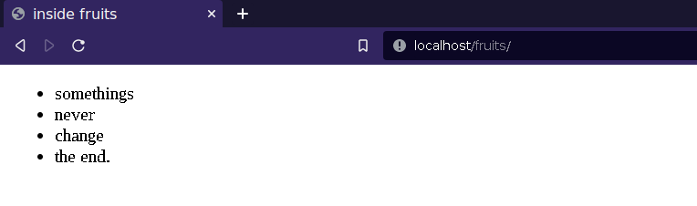
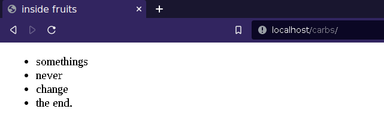
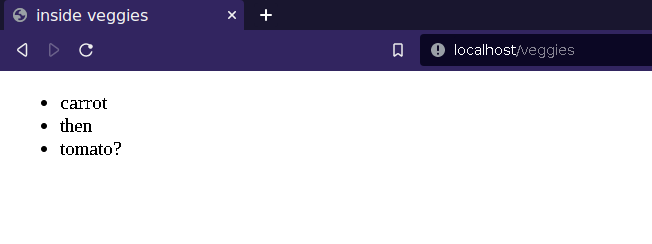
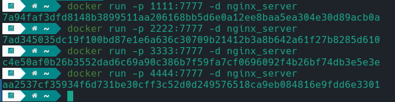
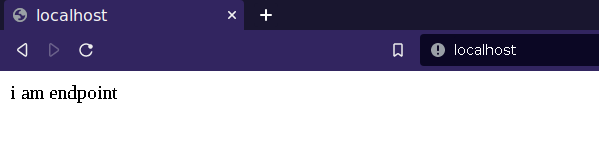
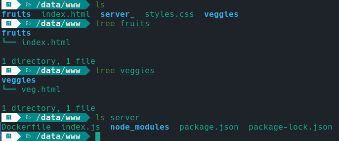

# Nginx Round-Robin Load Balancing: Explorations and Implementation
Welcome to the Nginx Round-Robin Load Balancing repository! This project aims to provide a comprehensive exploration of Nginx, a powerful and widely-used web server and reverse proxy server, focusing specifically on its round-robin load balancing capabilities.

## Overview
This project provides a comprehensive exploration of Nginx, a powerful web server and reverse proxy server, with a focus on implementing round-robin load balancing. The repository covers various aspects of Nginx, including 
- serving static content, 
- configuring mime types, 
- utilizing the location context, 
- performing rewrites and redirects, 
- and leveraging Nginx as a load balancer.
  
Each topic is accompanied by detailed explanations, code examples, and step-by-step instructions to help you understand and implement Nginx's round-robin load balancing capabilities. Whether you're new to Nginx or seeking to enhance your knowledge, this repository aims to provide valuable insights and practical guidance for optimizing web server performance.

## Serving Static Content and Configuring MIME types
When serving static content with Nginx, you need to make the necessary configurations in the `nginx.conf` file, which is typically located in the `/etc/nginx` directory.

Start by specifying the port number that Nginx will listen to for incoming requests. If necessary, provide the path to the directory where your HTML files are located. To handle specific MIME types like CSS, you have a couple of options. One approach is to include a `types` block within the server section and define the MIME types explicitly. For example:
```
bash
types {
    text/css   css;
    text/html  html;
}
```
This snippet associates the `.css` extension with the MIME type `text/css` and the `.html` extension with `text/html`. Alternatively, you can use the `mime.types` file, which contains a comprehensive list of MIME types.

 By including `include mime.types;` in your server section, you can utilize all the predefined MIME types without explicitly defining them. 

 

 ## Serving Different Content Using Location Context

When configuring Nginx to serve different content based on specific URLs, you can utilize the location context in the `nginx.conf` file. Here are some examples:
1. Serving index.html from a specific directory:

To serve the `index.html` file located in a separate directory, such as `/fruits`, you can define a new location `/fruits` within the server section. Set the `root` directive to the appropriate directory path. When accessing `localhost/fruits`, the content of `index.html` under `/fruits` will be displayed.



2. Alias for serving the same content under a different URL:

If you want to display the same content of `index.html` under another URL, such as `localhost/carbs`, you can use the `alias` directive within the `/carbs` location block. This allows you to serve the content from the original location while displaying it under a different URL.



3. Serving a specific HTML file from a different folder without an index.html:

In cases where you want to serve a specific HTML file from a different folder that doesn't have an `index.html`, such as `/veggies/veg.html`, you can use the `try_files` directive. This directive tries a series of file paths before displaying a 404 error. For example, within the `/veggies` location block, you can set the `try_files` directive to 
```
bash/veggies/veg.html /index.html =404`
```
 to attempt serving `veg.html` and then fallback to `index.html` if it doesn't exist.




 Remember to make these configurations within the appropriate `location` blocks in the `nginx.conf` file and restart the Nginx service for the changes to take effect, using the command:
 ```bash
 nginx -s reload
 ```
 or
 ```bash
 sudo systemctl restart nginx
 ```

## URL Rewrites and Redirects:

In the context of URL rewrites and redirects, we can achieve various functionalities using Nginx. Let's explore a couple of examples:

1. Redirecting `/crops` to `/veggies`:
To redirect the URL `/crops` to `/veggies`, we can use the `return` directive with the appropriate HTTP status code. For example:
```bash
location /crops {
    return 307 /veggies;
}
```
This configuration will issue a temporary redirect (HTTP 307) from `/crops` to `/veggies`. However, the URL in the browser will still show `/veggies` instead of `/crops`.

2. Rewriting the URL `/crop` to `/veggies`:
If we want the URL to show `/crops` in the browser while serving the contents of `/veggies`, we can use the `rewrite` directive. For example:
```bash
rewrite ^/crop /veggies;
```
This configuration will rewrite the incoming URL `/crops` to `/veggies` internally, without issuing a redirect. As a result, the contents of `/veggies` will be served, but the URL in the browser will still display `/crops`.


## Configuring NGINX as a Load Balancer with Docker Servers
In this setup, NGINX is configured as a `load balancer` to distribute incoming requests across multiple Docker servers. The Docker servers are running a JavaScript application and have their ports exposed. Here's a summary of the configuration steps:
1. Pull the NGINX Docker image using the command 
```bash
docker pull sarvesh20123/nginx_server
```
 This image contains the necessary components for running NGINX as a load balancer.
 2. Run the Docker servers in detached mode and link their exposed ports to the desired port using the command 
 ```bash
 docker run -p <host_port>:7777 -d nginx_server
```
 This command starts the Docker servers and maps their exposed port (7777) to the specified `<host_port>`.
 
 

 3. Open the NGINX configuration file located at /`etc/nginx/nginx.conf` and configure the load balancing settings.

4. Inside the NGINX configuration, define an `upstream` block named `backend` to specify the IP addresses and ports of the Docker servers.

5. In the server block, configure the virtual host for load balancing. Use the `location /` context and add the `proxy_pass` directive with the name of the upstream block (`backend`). This directive ensures that incoming requests are proxied to the Docker servers specified in the upstream block.

6. Save the NGINX configuration file and restart NGINX to apply the changes.

   


If you want to set up the Docker servers and the JavaScript application by yourself, follow these additional steps:



1. Create a new folder and navigate to it.

2. Initialize a new npm project by running `npm init -y` in the terminal.

3. Create an `index.js` file in the project folder and add the necessary logic for your JavaScript application.
4. In the `package.json` file, locate the `scripts` section and change the __start__ command to `node index`. This sets the start command to run the index.js file when using `npm run start`.
5. Test your JavaScript application by running `npm run start` in the terminal.
6. In the same location where the `index.js` file is located, create a Docker image by running
   ```bash
   docker build -t <image_name> .
   ```
   Replace `<image_name>` with the desired name for your Docker image.
7. Follow the previously mentioned steps to configure NGINX as a load balancer, substituting `<image_name>` with the name of the Docker image you created.

By following these steps, you can set up the Docker servers running your JavaScript application and configure NGINX as a load balancer to distribute traffic effectively. This provides scalability and improved performance for your application.

## License

This project is licensed under the GNU General Public License. See the [LICENSE](https://github.com/Saru2003/Exploring-Nginx-Round-Robin-Load-Balancing/blob/main/LICENSE) file for details.
